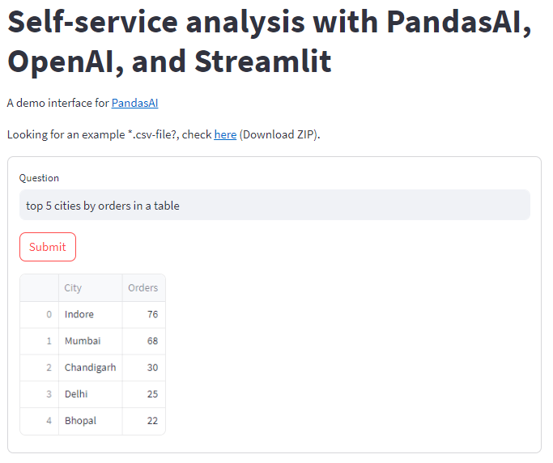
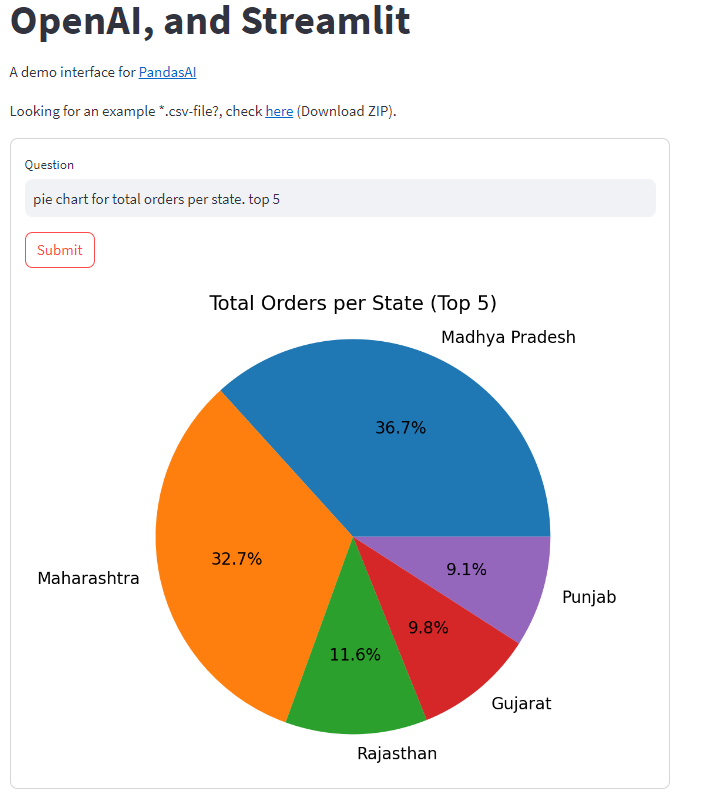

## Self-service Analysis using PandasAI, Streamlit, and Open AI (Talk to CSV)


### Project Overview
Empower yourself to delve into data, generate insights, and answer questions with ease through this self-service analytics application powered by PandasAI and OpenAI. This beginner-friendly guide equips you with the tools and knowledge to transform raw data into actionable intelligence.

While this project primarily focuses on data-driven insights using PandasAI and OpenAI, it could be further enhanced with chatbot capabilities. This integration would enable users to ask questions in natural language and receive context-relevant responses in the world of pandas-like analysis.

### Tech Stack
* [**Streamlit**](https://streamlit.io/): A web app framework for Python.
* [**PandasAI**](https://docs.pandas-ai.com/en/latest/): a Python library that adds Generative AI capabilities to pandas, the popular data analysis and manipulation tool
* [**Open AI**](https://platform.openai.com/docs/overview): A service to call the llm and pass it to PandasAI

### Features
1. Chat to csv file as pandas dataframe
2. Ease of use: PandasAI is designed to be easy to use, even if you are not familiar with generative AI or with pandas. You can simply ask questions to your data in natural language, and PandasAI will generate the code to answer your question.
3. Power: PandasAI can be used to perform a wide variety of tasks, including 
    * data exploration
    * analysis
    * visualization
    * cleaning
    * imputation
    * feature engineering.



### Installation
Follow the steps below to set up and run the PDF chatbot:

#### 1. Clone the Repository

```bash
git clone https://github.com/ridwanspace/openai-pandasai-streamlit.git
cd openai-pandasai-streamlit
```

#### 2. Install Dependencies
```bash
pip install -r requirements.txt
```

#### 3. Run the App
```bash
streamlit run app.py
```

### How to use
1. Enter your Open AI API Key. Get [here](https://platform.openai.com/api-keys) if you do not have one
2. Upload your csv
3. Start asking your prompt

Here suggested prompts. Modify for your own needs.

**Examples: 50 Queries to ask**

**`Simple Queries`**

* Who ... most?
* How many rows ...?
* How many ... are from .... and have been ...?
* Total for .....
* How many ... from ....?
* Create a pie chart for ...
* Create a bar chart for ...
* Plot a line chart ....
* Calculate the sum for ....
* Calculate the average for ...
* Create a box plot to ....
* How many ... has ...?
* What is the .... in .....?
* Plot the histogram of .... showing for each the... using different colors for each bar"
* Plot the ... against ...
* Return .... with count of distinct ....



**`Complex Queries`**

`Data Exploration:`
* Who has the most frequent purchase in the dataset?
* How many rows contain missing values in the "age" column?
* How many employees are from the marketing department and have been with the company for more than 5 years?
* What is the total revenue generated by each product category?
* How many customers live in each city?

`Trend Analysis:`
* Create a pie chart showing the distribution of customer sentiment scores.
* Plot a bar chart comparing sales figures across different quarters.
* Generate a line chart to visualize website traffic trends over the past month.
* Calculate the sum of monthly expenses for each department.
* Determine the average rating for each movie genre.

`Advanced Insights:`
* Create a box plot to compare income levels across different age groups.
* How many unique product IDs appear in each customer's order history?
* What is the average price of flights departing from each airport?
* Plot the histogram of exam scores, highlighting the percentage of students within each grade range.
* Visualize the correlation between temperature and ice cream sales.
* Return the top 10 most popular products along with their distinct order count.

`Custom Analysis:`
* Identify customers who spent more than $1000 in the last quarter and live within a 10-mile radius of our store.
* Find blog posts with the highest average engagement within the past year.
* Group employees by department and calculate the average salary for each group.
* Plot the distribution of house prices in different neighborhoods using a scatter plot.
* Predict the likelihood of customer churn based on past purchase behavior.

`Natural Language Queries:`
* Which city has the most active social media users?
* Are there any trends in customer complaints received over time?
* How does website traffic differ between mobile and desktop users?
* Tell me about the performance of our marketing campaigns across different channels.
* Can you identify any potential outliers in the sales data?

`Combining AI and Analytics:`
* Summarize the key insights from this customer survey dataset.
* Generate a text report describing the factors contributing to high employee turnover.
* Predict the potential sales figures for next quarter based on historical data.
* Recommend similar products to customers based on their past purchases.


To learn how to use PandasAI in Notebook, please go to this [repo](https://github.com/ridwanspace/openai-pandasai/tree/main)

### Cost
Check this [pricing](https://openai.com/pricing) in Open AI

### What's Next
You may modify this code to read other sources like:
* Excel
* MySql
* MongoDB
* BigQuery
* Redshift
* Snowflake
* Parquet
* Json
* etc

